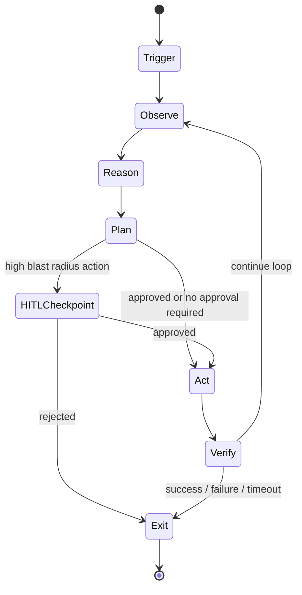

Design an agent loop architecture for the given workflow or governance objective.

## Determine the target

Accept any of:
- A workflow or objective: `PR governance`, `code remediation`, `dependency updates`
- A scoped description: `nightly security scan of open PRs`, `auto-label issues by severity`
- A local path for grounding: `src/agents/`, `.github/workflows/` — read to understand existing agent infrastructure before designing

If a local path is given, read relevant files to understand what tooling, APIs, and infrastructure already exist. The design should extend rather than duplicate existing work.

If only a description is given, state your assumptions about trigger mechanism, scope, and desired autonomy level before proceeding. Ask the user to confirm if assumptions are significant.

## Step 1: Classify the loop pattern

Before designing anything, classify which pattern best fits the target:

**Reactive** — triggered by an external event. Acts within a bounded, per-event scope. Examples: PR review bot, issue triage, alert response.
- Trigger: webhook, event queue, CI hook
- Scope: the single artifact that triggered the event
- Autonomy: typically higher — designed to act without waiting

**Proactive** — scheduled or continuously running sweep. Acts across a broader scope. Examples: nightly code quality scan, weekly dependency audit, continuous compliance check.
- Trigger: cron schedule or polling loop
- Scope: a defined set of repositories, services, or resources
- Autonomy: typically lower — broader scope demands more guardrails

**Conversational** — iterative, human-in-the-loop refinement. Agent proposes, human responds, loop continues. Examples: interactive refactoring, spec refinement, code generation with review.
- Trigger: human message or explicit invocation
- Scope: the current conversation context
- Autonomy: lowest — human is always in the loop

**Hierarchical** — an orchestrator loop that delegates to subagent loops. Examples: multi-repo remediation campaign, cross-service incident response.
- Trigger: any of the above
- Scope: composed from the scopes of subagent loops
- Autonomy: varies by layer — orchestrator may be conservative while subagents act freely within their scope

State the chosen pattern and the reasoning. If the workflow fits more than one pattern, design for the primary and note the secondary.

## Step 2: Define the loop phases

Every loop has a canonical set of phases. Adapt the names but keep the structure:

1. **Trigger** — what starts the loop, what input it receives, and what initial context is loaded
2. **Observe** — what the agent reads to understand the current state (files, APIs, metrics, prior loop output)
3. **Reason** — how the agent evaluates what it has observed against its policy (rules, heuristics, model call)
4. **Plan** — what actions the agent decides to take, in what order, and which require approval
5. **Act** — execution of planned actions, one at a time, with state checkpointing between actions
6. **Verify** — confirm the action had the intended effect; decide whether to continue, retry, or escalate
7. **Exit** — termination conditions: success, failure, timeout, escalation to human, or loop-back

For each phase, define:
- **Input**: what enters this phase
- **Output**: what leaves this phase
- **Decision point**: what branching logic exists (if any)
- **Failure mode**: what happens if this phase fails

## Step 3: Design the guardrail specification

Guardrails define what the agent must never do, independent of its instructions. They are enforced at the tool and scope level, not the prompt level.

Work through each dimension:

**Permission model**
Define read / write / execute permissions per resource type:

| Resource type | Read | Write | Execute | Notes |
|--------------|------|-------|---------|-------|
| Source files | ✅ | requires approval / ✅ / ❌ | — | |
| CI/CD pipelines | ✅ | ❌ | ❌ | |
| External APIs | ✅ | ✅ | — | rate limited |
| Shell commands | — | — | ❌ / scoped | |

**Scope constraints**
- Which repositories, branches, services, or environments is the agent allowed to touch?
- Is production always read-only? Is the main branch protected?
- Can the agent create branches? Open PRs? Merge PRs?

**Ambiguity handling**
When the agent cannot determine the correct action with sufficient confidence, what does it do?
- **Ask** — pause and request human clarification (use for HITL-compatible loops)
- **Skip** — log and move on (use for proactive loops where missing one item is acceptable)
- **Fail safe** — stop the loop and escalate (use when partial action is worse than no action)

**Rate and blast radius limits**
- Maximum files modified per loop run
- Maximum PRs opened or commented on per hour
- Maximum external API calls per run
- Maximum loop iterations before forced exit

**Scope escape prevention**
Actions the agent must never take regardless of instructions:
- Modify files outside the declared scope
- Delete or force-push to protected branches
- Transmit data to external systems not in the approved tool list
- Escalate its own permissions

## Step 4: Design HITL checkpoints

Define where human approval is required before the agent continues. Use this decision schema for each action:

| Action | Reversible? | Blast radius | Approval required? |
|--------|------------|-------------|-------------------|
| Read file | ✅ | None | No |
| Post comment | ⚠️ partial | Low | No |
| Apply code change | ⚠️ partial | Medium | Configurable |
| Open PR | ⚠️ partial | Medium | No (draft PR) / Yes (ready PR) |
| Merge PR | ❌ | High | Yes |
| Delete branch | ❌ | Medium | Yes |
| Call external API (write) | ❌ | Varies | Yes |

For each checkpoint requiring approval, define:
- **What the human sees**: the context, proposed action, and expected outcome
- **Approval options**: approve / reject / modify / escalate / snooze
- **Timeout behaviour**: what happens if no response within N minutes (default: fail safe)
- **Approval surface**: where approval is given (PR comment, Slack message, webhook, dedicated UI)

## Step 5: Define tool contracts

For each tool the agent uses, specify:

| Tool | Input schema | Output schema | Side effects | Idempotent? | HITL required? |
|------|-------------|---------------|-------------|------------|----------------|
| {name} | {key fields} | {key fields} | {what it changes} | yes / no | yes / no |

**Tool contract rules:**
- Destructive tools (delete, merge, deploy) must have HITL required = yes unless explicitly overridden by the loop design
- Idempotent tools may be retried automatically on failure
- Non-idempotent tools must checkpoint state before execution so partial runs can be resumed

## Step 6: Define observability requirements

An agent loop without observability is unsafe to run in production. Define:

**What to log per loop run:**
- Trigger event and input context
- Each phase transition with timestamp
- Each tool call: name, inputs, outputs, duration
- Each HITL checkpoint: action proposed, approval decision, approver, timestamp
- Exit condition and final state

**Alerts to configure:**
- Loop run time exceeds threshold (stuck or runaway loop)
- Consecutive failures exceed threshold
- HITL checkpoint timeout (no human response)
- Blast radius limit approaching (e.g. 80% of max files modified)
- Unexpected scope escape attempt

**Metrics to track:**
- Loop success / failure rate
- Mean time per phase
- HITL approval rate and latency
- Tool call error rate per tool

## Output format

Respond inline by default. If the user passes `--save`, write to `docs/agents/{kebab-case-name}.md`.

### Agent Loop Design: `{target}`

**Pattern:** {Reactive / Proactive / Conversational / Hierarchical} — {one sentence rationale}

**Loop Architecture Diagram**

Adapt the diagram to the specific phases and branching logic of the target loop.

**Phase Breakdown**

For each phase: input, output, decision point, failure mode — in a consistent format.

**Guardrail Specification**

Permission model table, scope constraints, ambiguity handling policy, rate/blast radius limits, and scope escape prevention rules.

**HITL Checkpoint Schema**

Decision table (action / reversible / blast radius / approval required) and, for each checkpoint, the approval surface, options, and timeout behaviour.

**Tool Contracts**

Tool contract table with input schema, output schema, side effects, idempotency, and HITL requirement.

**Observability Requirements**

What to log, alerts to configure, and metrics to track.

**Open Questions**

Decisions that must be resolved before implementation — name the owner and the information needed for each.

## Gotchas

- Guardrails must be enforced at the tool and scope level, not the prompt level. A prompt instruction like "do not modify production" can be overridden by a jailbreak or a poorly specified instruction in a future turn. Tool permissions cannot.
- HITL checkpoints are not optional for irreversible actions. An agent that can merge, delete, or deploy without human approval is a production incident waiting to happen — regardless of how well-tested the loop is.
- Define timeout behaviour for every HITL checkpoint. An unanswered checkpoint that defaults to "proceed" is not a checkpoint.
- Ambiguity handling must be explicit. An agent that guesses when uncertain will eventually guess wrong at scale. Design the policy before deployment, not after the first incident.
- Proactive loops need explicit scope constraints. A reactive loop is naturally bounded by its trigger event. A proactive loop that can touch any file in any repository is a blast radius problem.
- Hierarchical loops must define the trust boundary between orchestrator and subagent. A subagent should not be able to escalate its own permissions by convincing the orchestrator to authorize an action outside the declared scope.
- Observability is a safety requirement, not a nice-to-have. A loop you cannot monitor is a loop you cannot trust in production.
